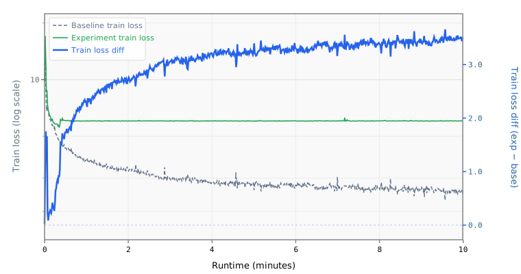

# 001 Weight Decay

Adds weight decay of 0.04 to all optimizer groups (Muon and Adam).

## Change from baseline

- `weight_decay`: 0.0 → 0.04 on Muon (matrix params)
- `weight_decay`: 0.0 → 0.04 on Adam (embeddings, block scalars)

## Source

Both top Parameter Golf submissions use WD=0.04 across all optimizer groups:
- `records/track_10min_16mb/2026-03-20_10L_Int5MLP_MuonWD04_SWA50` (1st place, 1.1428 BPB)
- `records/track_10min_16mb/2026-03-20_Int6_MLP3x_SmearGate_BigramHash_MuonWD_SWA` (2nd place, 1.1458 BPB)

## Expected impact

- Regularizes weight magnitudes, directly improving post-training quantization quality
- Ablation from 1st place submission shows WD=0.04 contributes ~0.0001 BPB directly, but the indirect benefit to quantization is larger

## Runtime Overrides

```yaml
training.pre_training.batch_size: 16
training.pre_training.data.TokenizedDataset.path: /home/kingsley/github/parameter-golf/data/datasets/fineweb10B_sp1024/fineweb_train_*.bin
tokenizers.default.SentencePiece.model_path: /home/kingsley/github/parameter-golf/data/tokenizers/fineweb_1024_bpe.model
```

## Results

- **Steps:** 675
- **Tokens:** 88.5M
- **Train loss:** 6.0388
- **Val loss:** 6.0327
- **Val BPB:** 3.5729

## Train Loss Curve



## vs Baseline ([artifacts_1x_gb10](../../baseline/artifacts_1x_gb10))

- **Val BPB:** 3.5729 vs 1.5297 (+2.0432)

| | train loss | full | int6 | int8 | mxfp4 | nvfp4 |
| :--- | ---: | ---: | ---: | ---: | ---: | ---: |
| **Experiment** | 6.0388 | 3.5729 | nan | 3.5737 | 3.5951 | 3.5736 |
| **Baseline** | 2.6172 | 1.5297 | 1.5433 | 1.5305 | 1.6281 | 1.6081 |
| **Delta** | +3.4217 | +2.0432 | nan | +2.0431 | +1.9670 | +1.9655 |

## Quantization

| | int6 | int8 | mxfp4 | nvfp4 |
| :--- | ---: | ---: | ---: | ---: |
| **BPB** | nan | 3.5737 | 3.5951 | 3.5736 |
| **Size** | 4.1 MB | 8.3 MB | 8.5 MB | 9.2 MB |

## Config Changes vs Baseline

**train.yaml:**

```diff
@@ -2,19 +2,10 @@
 model_name: baseline
 training:
   pre_training:
-    # Global batch = max(gpus, 8) * batch_size * sequence_length tokens.
-    # At the reference 8 GPUs this is 524,288 tokens; with more GPUs the
-    # global batch scales up rather than accumulating.
-    # GradientAccumulation auto-computes micro-batching from world_size:
-    #   1 GPU  -> grad_accum = 8 (8 micro-batches of 64 seqs)
-    #   8 GPUs -> grad_accum = 1 (no accumulation needed)
     gpus: !env WORLD_SIZE:1
     batch_size: 64
     sequence_length: !expr "model.context_length"
     total_batch_tokens: !expr "max(self.gpus, 8) * self.batch_size * self.sequence_length"
-    # 10-minute wallclock cap matching the challenge constraint.
-    # Combined with max_steps as a safety limit - training stops when
-    # either condition is met first.
     max_wallclock_seconds: 600
     warmup_steps: 10
     model_trainer:
@@ -27,7 +18,7 @@
                 momentum: 0.95
                 nesterov: true
                 ns_steps: 5
-                weight_decay: 0.0
+                weight_decay: 0.04
                 features:
                   - HyperparameterSchedule:
                       parameter: momentum
@@ -44,6 +35,7 @@
                     lr: 0.05
                     betas: [0.9, 0.95]
                     eps: 1.0e-8
+                    weight_decay: 0.04
               - name: block_scalars
                 max_ndim: 1
                 optimizer:
@@ -51,15 +43,7 @@
                     lr: 0.04
                     betas: [0.9, 0.95]
                     eps: 1.0e-8
-              # With tied embeddings, the head group shares weights with
-              # embedding via TiedLayers.  If untied, add a head group:
-              # - name: head
-              #   patterns: ["heads.*"]
-              #   optimizer:
-              #     Adam:
-              #       lr: 0.008
-              #       betas: [0.9, 0.95]
-              #       eps: 1.0e-8
+                    weight_decay: 0.04
         scheduler:
           WallclockWarmdown:
             warmdown_steps: 1200
```

## Platform

- **GPU:** NVIDIA GB10 (119.7 GB)
- **GPUs:** 1
- **CPU:** aarch64 (20 cores)
- **RAM:** 120 GB
- **Software:** PyTorch 2.10.0+cu130, CUDA 13.0
