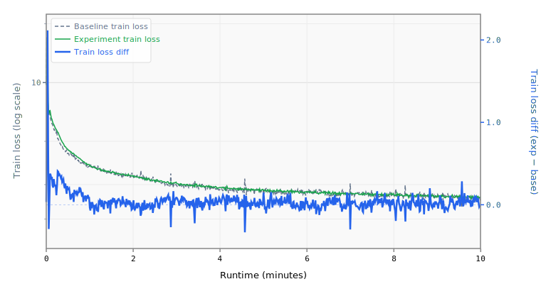

# 002 Longer Warmdown

Extends the learning rate warmdown from 1200 to 3000 steps.

## Change from baseline

- `warmdown_steps`: 1200 → 3000

## Source

Both top submissions use warmdown of 3000 steps:
- `records/track_10min_16mb/2026-03-20_10L_Int5MLP_MuonWD04_SWA50`
- `records/track_10min_16mb/2026-03-20_Int6_MLP3x_SmearGate_BigramHash_MuonWD_SWA`

## Expected impact

- More gradual LR decay allows better weight stabilization before final checkpoint
- Works synergistically with SWA (not yet implemented) — the longer tail provides more well-converged checkpoints to average
- Estimated ~0.0005 BPB improvement

## Runtime Overrides

```yaml
training.pre_training.batch_size: 16
training.pre_training.data.TokenizedDataset.path: /home/kingsley/github/parameter-golf/data/datasets/fineweb10B_sp1024/fineweb_train_*.bin
tokenizers.default.SentencePiece.model_path: /home/kingsley/github/parameter-golf/data/tokenizers/fineweb_1024_bpe.model
```

## Results

- **Steps:** 677
- **Tokens:** 88.7M
- **Train loss:** 2.5939
- **Val loss:** 2.5872
- **Val BPB:** 1.5323

## Train Loss Curve



## vs Baseline ([artifacts_1x_gb10_2](../../baseline/artifacts_1x_gb10_2))

- **Val BPB:** 1.5323 vs 1.5347 (-0.0024)

| | train loss | full | int6 | int8 | mxfp4 | nvfp4 |
| :--- | ---: | ---: | ---: | ---: | ---: | ---: |
| **Experiment** | 2.5939 | 1.5323 | 1.5486 | 1.5328 | 1.6451 | 1.6147 |
| **Baseline** | 2.4895 | 1.5347 | 1.5494 | 1.5522 | 1.6563 | 1.6697 |
| **Delta** | +0.1044 | -0.0024 | -0.0009 | -0.0194 | -0.0112 | -0.0549 |

## Quantization

| | int6 | int8 | mxfp4 | nvfp4 |
| :--- | ---: | ---: | ---: | ---: |
| **BPB** | 1.5486 | 1.5328 | 1.6451 | 1.6147 |
| **Size** | 10.3 MB | 14.0 MB | 8.6 MB | 9.2 MB |

## Config Changes vs Baseline

**train.yaml:**

```diff
@@ -44,7 +44,7 @@
                     eps: 1.0e-8
         scheduler:
           WallclockWarmdown:
-            warmdown_steps: 1200
+            warmdown_steps: 3000
             decay_type: linear
         compile:
           fullgraph: true
@@ -63,7 +63,7 @@
     data:
       TokenizedDataset:
         path: /workspace/parameter-golf/data/datasets/fineweb10B_sp1024/fineweb_train_*.bin
-        shuffle: false
+        shuffle: true
         bin_header_bytes: 1024
     features:
       - SystemDiagnostics:
```

**model.yaml:**

```diff
@@ -6,7 +6,6 @@
       TokenEmbedding:
         init_method: normal
         init_std: 0.005
-        dtype: bfloat16
         norm: RMSNorm
     block:
       SequentialBlock:
@@ -93,7 +92,6 @@
     features:
       - TiedLayers:
           heads.clm.head.weight: embedding.tok_emb.weight
-      - CachedRoPE
 models:
   baseline:
     DecoderTransformer:
```

## Platform

- **GPU:** NVIDIA GB10 (119.7 GB)
- **GPUs:** 1
- **CPU:** aarch64 (20 cores)
- **RAM:** 120 GB
- **Software:** PyTorch 2.10.0+cu130, CUDA 13.0
