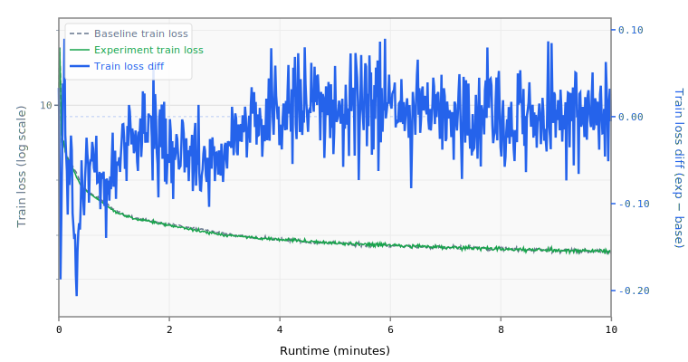

# 003 Gradient Clipping

Adds gradient norm clipping at 0.3 to the Muon optimizer.

## Change from baseline

- Added `GradClip` feature with `max_grad_norm: 0.3` to Muon

## Source

Top submissions use gradient clipping at 0.3:
- `records/track_10min_16mb/2026-03-20_10L_Int5MLP_MuonWD04_SWA50`

## Expected impact

- Stabilizes training with the aggressive Muon learning rate (0.04)
- Prevents rare gradient spikes from destabilizing later training
- Estimated ~0.0003 BPB improvement, primarily by enabling other techniques to work better

## Runtime Overrides

```yaml
training.pre_training.batch_size: 16
training.pre_training.data.TokenizedDataset.path: /home/kingsley/github/parameter-golf/data/datasets/fineweb10B_sp1024/fineweb_train_*.bin
tokenizers.default.SentencePiece.model_path: /home/kingsley/github/parameter-golf/data/tokenizers/fineweb_1024_bpe.model
```

## Results

- **Steps:** 675
- **Tokens:** 88.5M
- **Train loss:** 2.5856
- **Val loss:** 2.5843
- **Val BPB:** 1.5306

## Train Loss Curve



## vs Baseline ([artifacts_1x_gb10](../../baseline/artifacts_1x_gb10))

- **Val BPB:** 1.5306 vs 1.5297 (+0.0009)

| | train loss | full | int6 | int8 | mxfp4 | nvfp4 |
| :--- | ---: | ---: | ---: | ---: | ---: | ---: |
| **Experiment** | 2.5856 | 1.5306 | 1.5466 | 1.5319 | 1.6248 | 1.6050 |
| **Baseline** | 2.6172 | 1.5297 | 1.5433 | 1.5305 | 1.6281 | 1.6081 |
| **Delta** | -0.0316 | +0.0009 | +0.0033 | +0.0013 | -0.0033 | -0.0031 |

## Quantization

| | int6 | int8 | mxfp4 | nvfp4 |
| :--- | ---: | ---: | ---: | ---: |
| **BPB** | 1.5466 | 1.5319 | 1.6248 | 1.6050 |
| **Size** | 9.7 MB | 13.9 MB | 8.6 MB | 9.2 MB |

## Config Changes vs Baseline

**train.yaml:**

```diff
@@ -29,6 +29,8 @@
                 ns_steps: 5
                 weight_decay: 0.0
                 features:
+                  - GradClip:
+                      max_grad_norm: 0.3
                   - HyperparameterSchedule:
                       parameter: momentum
                       initial: 0.85
```

## Platform

- **GPU:** NVIDIA GB10 (119.7 GB)
- **GPUs:** 1
- **CPU:** aarch64 (20 cores)
- **RAM:** 120 GB
- **Software:** PyTorch 2.10.0+cu130, CUDA 13.0
