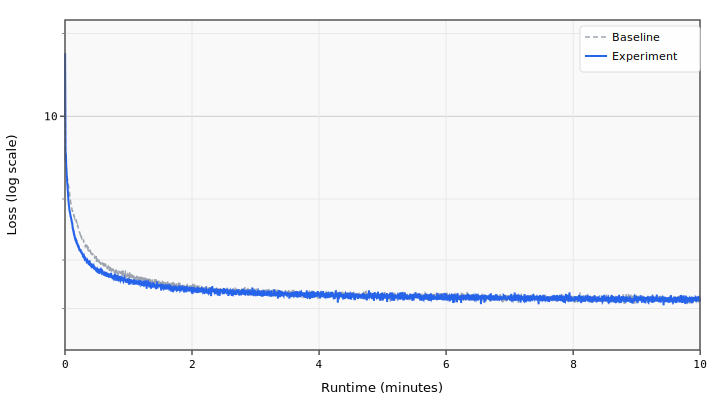

# 003 Gradient Clipping

Adds gradient norm clipping at 0.3 to the Muon optimizer.

## Change from baseline

- Added `GradClip` feature with `max_grad_norm: 0.3` to Muon

## Source

Top submissions use gradient clipping at 0.3:
- `records/track_10min_16mb/2026-03-20_10L_Int5MLP_MuonWD04_SWA50`

## Expected impact

- Stabilizes training with the aggressive Muon learning rate (0.04)
- Prevents rare gradient spikes from destabilizing later training
- Estimated ~0.0003 BPB improvement, primarily by enabling other techniques to work better

## Runtime Overrides

```yaml
training.pre_training.batch_size: 80
```

## Results

- **Steps:** 4301
- **Train loss:** 2.1749
- **Val loss:** 2.1535
- **Val BPB:** 1.2754

## Train Loss Curve



## vs Baseline ([artifacts_8x_rtx_pro_6000_4](../../baseline/artifacts_8x_rtx_pro_6000_4))

- **Val BPB:** 1.2754 vs 1.2764 (-0.0009)

| | full | int6 | int8 | nvfp4 |
| :--- | ---: | ---: | ---: | ---: |
| **Experiment** | 1.2754 | 1.3444 | 1.3433 | 1.6574 |
| **Baseline** | 1.2764 | 1.3580 | 1.3570 | 1.7303 |
| **Delta** | -0.0009 | -0.0137 | -0.0137 | -0.0729 |

## Quantization

| | int6 | int8 | mxfp4 | nvfp4 |
| :--- | ---: | ---: | ---: | ---: |
| **BPB** | 1.3444 | 1.3433 | 1.6938 | 1.6574 |
| **Size** | 12.8 MB | 12.3 MB | 8.6 MB | 9.4 MB |

## Config Changes vs Baseline

**train.yaml:**

```diff
@@ -29,6 +29,8 @@
                 ns_steps: 5
                 weight_decay: 0.0
                 features:
+                  - GradClip:
+                      max_grad_norm: 0.3
                   - HyperparameterSchedule:
                       parameter: momentum
                       initial: 0.85
```

## Platform

- **GPU:** NVIDIA RTX PRO 6000 Blackwell Server Edition (94.97 GB)
- **GPUs:** 8
- **CPU:** AMD EPYC 9355 32-Core Processor (128 cores)
- **RAM:** 2015 GB
- **Software:** PyTorch 2.10.0+cu128, CUDA 12.8
