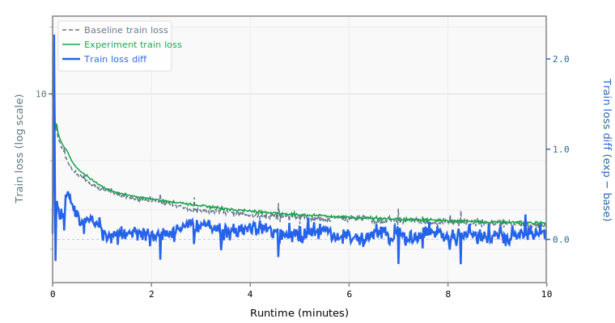

# 004 Momentum Warmup

Widens the Muon momentum warmup ramp: 0.92→0.99 over 1500 steps (vs baseline 0.85→0.95 over 500).

## Change from baseline

- `momentum`: 0.95 → 0.99 (final value)
- Momentum schedule `initial`: 0.85 → 0.92
- Momentum schedule `final`: 0.95 → 0.99
- Momentum schedule `warmup_steps`: 500 → 1500

## Source

Both top submissions use momentum 0.92→0.99 over 1500 steps:
- `records/track_10min_16mb/2026-03-20_10L_Int5MLP_MuonWD04_SWA50`
- `records/track_10min_16mb/2026-03-20_Int6_MLP3x_SmearGate_BigramHash_MuonWD_SWA`

## Expected impact

- Higher final momentum (0.99) provides stronger smoothing in later training
- Longer warmup (1500 steps) prevents instability from high momentum early on
- Extends the effective convergence window within the 10-minute budget

## Runtime Overrides

```yaml
training.pre_training.batch_size: 16
training.pre_training.data.TokenizedDataset.path: /home/kingsley/github/parameter-golf/data/datasets/fineweb10B_sp1024/fineweb_train_*.bin
tokenizers.default.SentencePiece.model_path: /home/kingsley/github/parameter-golf/data/tokenizers/fineweb_1024_bpe.model
```

## Results

- **Steps:** 674
- **Tokens:** 88.3M
- **Train loss:** 2.6224
- **Val loss:** 2.6164
- **Val BPB:** 1.5496

## Train Loss Curve



## vs Baseline ([artifacts_1x_gb10_2](../../baseline/artifacts_1x_gb10_2))

- **Val BPB:** 1.5496 vs 1.5347 (+0.0149)

| | train loss | full | int6 | int8 | mxfp4 | nvfp4 |
| :--- | ---: | ---: | ---: | ---: | ---: | ---: |
| **Experiment** | 2.6224 | 1.5496 | 1.5651 | 1.5506 | 1.6686 | 1.6268 |
| **Baseline** | 2.4895 | 1.5347 | 1.5494 | 1.5522 | 1.6563 | 1.6697 |
| **Delta** | +0.1329 | +0.0149 | +0.0157 | -0.0016 | +0.0123 | -0.0428 |

## Quantization

| | int6 | int8 | mxfp4 | nvfp4 |
| :--- | ---: | ---: | ---: | ---: |
| **BPB** | 1.5651 | 1.5506 | 1.6686 | 1.6268 |
| **Size** | 10.0 MB | 14.4 MB | 8.6 MB | 9.2 MB |

## Config Changes vs Baseline

**train.yaml:**

```diff
@@ -15,18 +15,18 @@
             default_optimizer:
               Muon:
                 lr: 0.04
-                momentum: 0.95
+                momentum: 0.99
                 nesterov: true
                 ns_steps: 5
                 weight_decay: 0.0
                 features:
                   - HyperparameterSchedule:
                       parameter: momentum
-                      initial: 0.85
-                      final: 0.95
+                      initial: 0.92
+                      final: 0.99
                       scheduler:
                         LinearWarmup:
-                          warmup_steps: 500
+                          warmup_steps: 1500
             groups:
               - name: embedding
                 patterns: ["embedding.*"]
@@ -63,7 +63,7 @@
     data:
       TokenizedDataset:
         path: /workspace/parameter-golf/data/datasets/fineweb10B_sp1024/fineweb_train_*.bin
-        shuffle: false
+        shuffle: true
         bin_header_bytes: 1024
     features:
       - SystemDiagnostics:
```

**model.yaml:**

```diff
@@ -6,7 +6,6 @@
       TokenEmbedding:
         init_method: normal
         init_std: 0.005
-        dtype: bfloat16
         norm: RMSNorm
     block:
       SequentialBlock:
@@ -93,7 +92,6 @@
     features:
       - TiedLayers:
           heads.clm.head.weight: embedding.tok_emb.weight
-      - CachedRoPE
 models:
   baseline:
     DecoderTransformer:
```

## Platform

- **GPU:** NVIDIA GB10 (119.7 GB)
- **GPUs:** 1
- **CPU:** aarch64 (20 cores)
- **RAM:** 120 GB
- **Software:** PyTorch 2.10.0+cu130, CUDA 13.0
