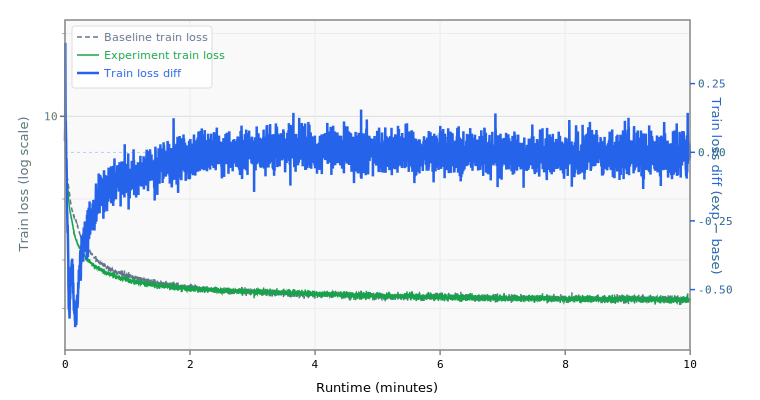

# 004 Momentum Warmup

Widens the Muon momentum warmup ramp: 0.92→0.99 over 1500 steps (vs baseline 0.85→0.95 over 500).

## Change from baseline

- `momentum`: 0.95 → 0.99 (final value)
- Momentum schedule `initial`: 0.85 → 0.92
- Momentum schedule `final`: 0.95 → 0.99
- Momentum schedule `warmup_steps`: 500 → 1500

## Source

Both top submissions use momentum 0.92→0.99 over 1500 steps:
- `records/track_10min_16mb/2026-03-20_10L_Int5MLP_MuonWD04_SWA50`
- `records/track_10min_16mb/2026-03-20_Int6_MLP3x_SmearGate_BigramHash_MuonWD_SWA`

## Expected impact

- Higher final momentum (0.99) provides stronger smoothing in later training
- Longer warmup (1500 steps) prevents instability from high momentum early on
- Extends the effective convergence window within the 10-minute budget

## Runtime Overrides

```yaml
training.pre_training.batch_size: 80
```

## Results

- **Steps:** 4292
- **Tokens:** 2812.8M
- **Train loss:** 2.1632
- **Val loss:** 2.1481
- **Val BPB:** 1.2722

## Train Loss Curve



## vs Baseline ([artifacts_8x_rtx_pro_6000_4](../../baseline/artifacts_8x_rtx_pro_6000_4))

- **Val BPB:** 1.2722 vs 1.2764 (-0.0042)

| | train loss | full | int6 | int8 | mxfp4 | nvfp4 |
| :--- | ---: | ---: | ---: | ---: | ---: | ---: |
| **Experiment** | 2.1632 | 1.2722 | 1.3825 | 1.2794 | 2.3571 | 1.9462 |
| **Baseline** | 2.1428 | 1.2764 | 1.3580 | 1.2806 | 1.8141 | 1.6003 |
| **Delta** | +0.0203 | -0.0042 | +0.0244 | -0.0012 | +0.5430 | +0.3459 |

## Quantization

| | int6 | int8 | mxfp4 | nvfp4 |
| :--- | ---: | ---: | ---: | ---: |
| **BPB** | 1.3825 | 1.2794 | 2.3571 | 1.9462 |
| **Size** | 11.5 MB | 15.7 MB | 8.7 MB | 9.2 MB |

## Config Changes vs Baseline

**train.yaml:**

```diff
@@ -24,18 +24,18 @@
             default_optimizer:
               Muon:
                 lr: 0.04
-                momentum: 0.95
+                momentum: 0.99
                 nesterov: true
                 ns_steps: 5
                 weight_decay: 0.0
                 features:
                   - HyperparameterSchedule:
                       parameter: momentum
-                      initial: 0.85
-                      final: 0.95
+                      initial: 0.92
+                      final: 0.99
                       scheduler:
                         LinearWarmup:
-                          warmup_steps: 500
+                          warmup_steps: 1500
             groups:
               - name: embedding
                 patterns: ["embedding.*"]
```

## Platform

- **GPU:** NVIDIA RTX PRO 6000 Blackwell Server Edition (94.97 GB)
- **GPUs:** 8
- **CPU:** AMD EPYC 9355 32-Core Processor (128 cores)
- **RAM:** 2015 GB
- **Software:** PyTorch 2.10.0+cu128, CUDA 12.8
