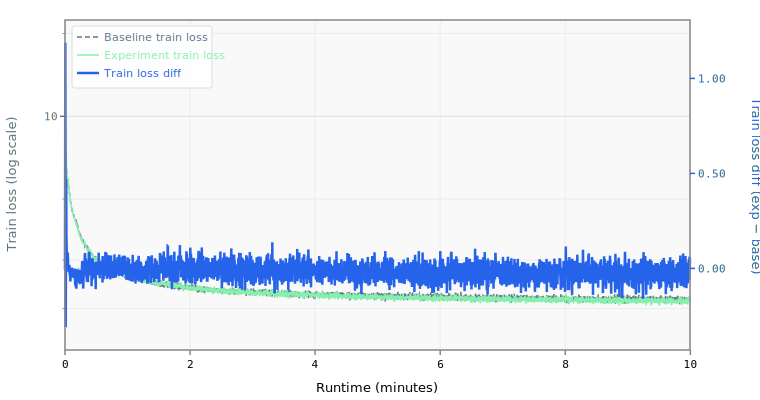

# 005 MLP 3x Expansion

Increases the FFN intermediate size from 2x to 3x hidden dimension (1024 → 1536).

## Change from baseline

- `mlp_mult`: 2 → 3 in model.yaml
- `intermediate_size`: 1024 → 1536 (computed via `mlp_mult * hidden_size`)
- Adds ~2.4M parameters (from ~17M to ~19.4M)

## Source

Both top submissions use 3x MLP expansion, funded by aggressive quantization:
- `records/track_10min_16mb/2026-03-20_10L_Int5MLP_MuonWD04_SWA50` (3x MLP + 10 layers)
- `records/track_10min_16mb/2026-03-20_Int6_MLP3x_SmearGate_BigramHash_MuonWD_SWA` (3x MLP + 9 layers)

## Expected impact

- Single largest architectural contributor: ~0.003 BPB improvement
- The wider FFN increases model capacity where it matters most (feed-forward layers dominate parameter count)
- Requires int6 quantization to fit under 16 MB — at int6 the baseline uses 12.3 MB, leaving headroom for ~3.7 MB of extra parameters

## Notes

- The larger model will train slightly slower per step but should converge to a lower loss within the 10-minute budget
- Must be evaluated with int6 quantization to assess contest viability

## Runtime Overrides

```yaml
training.pre_training.batch_size: 80
```

## Results

- **Steps:** 3640
- **Tokens:** 2385.5M
- **Train loss:** 2.1994
- **Val loss:** 2.1299
- **Val BPB:** 1.2614

## Train Loss Curve



## vs Baseline ([artifacts_8x_rtx_pro_6000_4](../../baseline/artifacts_8x_rtx_pro_6000_4))

- **Val BPB:** 1.2614 vs 1.2764 (-0.0149)

| | train loss | full | int6 | int8 | mxfp4 | nvfp4 |
| :--- | ---: | ---: | ---: | ---: | ---: | ---: |
| **Experiment** | 2.1994 | 1.2614 | 1.3111 | 1.2643 | 1.5457 | 1.4770 |
| **Baseline** | 2.1428 | 1.2764 | 1.3580 | 1.2806 | 1.8141 | 1.6003 |
| **Delta** | +0.0566 | -0.0149 | -0.0469 | -0.0163 | -0.2684 | -0.1234 |

## Quantization

| | int6 | int8 | mxfp4 | nvfp4 |
| :--- | ---: | ---: | ---: | ---: |
| **BPB** | 1.3111 | 1.2643 | 1.5457 | 1.4770 |
| **Size** | 14.4 MB | 19.9 MB | 11.0 MB | 11.7 MB |

## Config Changes vs Baseline

**train.yaml:**

```diff
@@ -63,7 +63,7 @@
     data:
       TokenizedDataset:
         path: /workspace/parameter-golf/data/datasets/fineweb10B_sp1024/fineweb_train_*.bin
-        shuffle: false
+        shuffle: true
         bin_header_bytes: 1024
     features:
       - SystemDiagnostics:
```

**model.yaml:**

```diff
@@ -6,7 +6,6 @@
       TokenEmbedding:
         init_method: normal
         init_std: 0.005
-        dtype: bfloat16
         norm: RMSNorm
     block:
       SequentialBlock:
@@ -93,7 +92,6 @@
     features:
       - TiedLayers:
           heads.clm.head.weight: embedding.tok_emb.weight
-      - CachedRoPE
 models:
   baseline:
     DecoderTransformer:
@@ -104,7 +102,7 @@
       num_attention_heads: 8
       num_key_value_heads: 4
       head_dim: 64
-      mlp_mult: 2
+      mlp_mult: 3
       intermediate_size: !expr "self.mlp_mult * self.hidden_size"
       num_encoder_layers: !expr "self.num_layers // 2"
       num_decoder_layers: !expr "self.num_layers - self.num_encoder_layers"
```

## Platform

- **GPU:** NVIDIA RTX PRO 6000 Blackwell Server Edition (94.97 GB)
- **GPUs:** 8
- **CPU:** AMD EPYC 9355 32-Core Processor (128 cores)
- **RAM:** 2015 GB
- **Software:** PyTorch 2.10.0+cu128, CUDA 12.8
