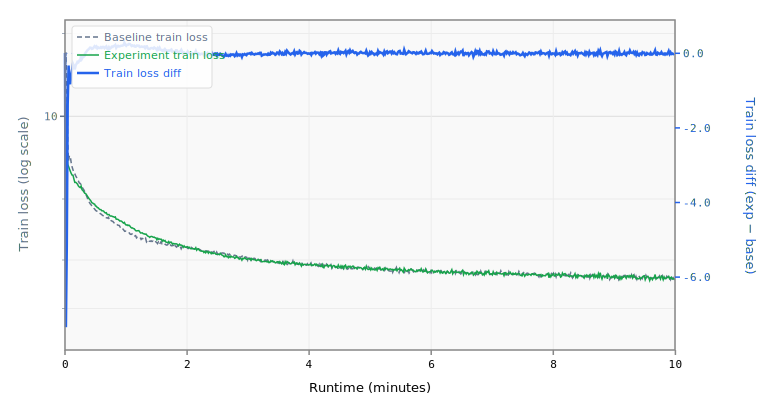

# 008 Lower Learning Rates

Halves the Muon and Adam learning rates based on a systematic 6-point sweep.

## Change from baseline

- Muon `lr`: 0.04 → 0.02
- Adam (block_scalars) `lr`: 0.04 → 0.02
- Adam (embedding) `lr`: 0.05 → 0.03

## Source

- `reference/track_10min_16mb/2026-03-18_LowerLR/`
- 6-point LR sweep showed baseline matrix_lr=0.04 was ~2x too high; optimum at 0.02
- Sweep results: 0.06 (+0.016), 0.04 (baseline), 0.03 (-0.001), 0.025 (-0.004), **0.02 (-0.006)**, 0.015 (-0.005)

## Expected impact

- Estimated ~-0.001 to -0.002 BPB
- Modest improvement on its own but establishes the correct LR baseline for combining with other techniques
- Note: source record ran on H200, not H100; results may differ slightly

## Status

**Runnable.**

## Runtime Overrides

```yaml
training.pre_training.batch_size: 16
training.pre_training.data.TokenizedDataset.path: /home/kingsley/github/parameter-golf/data/datasets/fineweb10B_sp1024/fineweb_train_*.bin
tokenizers.default.SentencePiece.model_path: /home/kingsley/github/parameter-golf/data/tokenizers/fineweb_1024_bpe.model
```

## Results

- **Steps:** 678
- **Tokens:** 88.9M
- **Train loss:** 2.5614
- **Val loss:** 2.5768
- **Val BPB:** 1.5261

## Train Loss Curve



## vs Baseline ([artifacts_1x_gb10_2](../../baseline/artifacts_1x_gb10_2))

- **Val BPB:** 1.5261 vs 1.5347 (-0.0086)

| | train loss | full | int6 | int8 | mxfp4 | nvfp4 |
| :--- | ---: | ---: | ---: | ---: | ---: | ---: |
| **Experiment** | 2.5614 | 1.5261 | 1.5448 | 1.5278 | 1.5707 | 1.5623 |
| **Baseline** | 2.4895 | 1.5347 | 1.5494 | 1.5522 | 1.6563 | 1.6697 |
| **Delta** | +0.0719 | -0.0086 | -0.0046 | -0.0244 | -0.0856 | -0.1074 |

## Quantization

| | int6 | int8 | mxfp4 | nvfp4 |
| :--- | ---: | ---: | ---: | ---: |
| **BPB** | 1.5448 | 1.5278 | 1.5707 | 1.5623 |
| **Size** | 8.3 MB | 12.1 MB | 8.6 MB | 9.2 MB |

## Config Changes vs Baseline

**train.yaml:**

```diff
@@ -14,7 +14,7 @@
           LayerWise:
             default_optimizer:
               Muon:
-                lr: 0.04
+                lr: 0.02
                 momentum: 0.95
                 nesterov: true
                 ns_steps: 5
@@ -32,14 +32,14 @@
                 patterns: ["embedding.*"]
                 optimizer:
                   Adam:
-                    lr: 0.05
+                    lr: 0.03
                     betas: [0.9, 0.95]
                     eps: 1.0e-8
               - name: block_scalars
                 max_ndim: 1
                 optimizer:
                   Adam:
-                    lr: 0.04
+                    lr: 0.02
                     betas: [0.9, 0.95]
                     eps: 1.0e-8
         scheduler:
@@ -63,7 +63,7 @@
     data:
       TokenizedDataset:
         path: /workspace/parameter-golf/data/datasets/fineweb10B_sp1024/fineweb_train_*.bin
-        shuffle: false
+        shuffle: true
         bin_header_bytes: 1024
     features:
       - SystemDiagnostics:
```

**model.yaml:**

```diff
@@ -6,7 +6,6 @@
       TokenEmbedding:
         init_method: normal
         init_std: 0.005
-        dtype: bfloat16
         norm: RMSNorm
     block:
       SequentialBlock:
@@ -93,7 +92,6 @@
     features:
       - TiedLayers:
           heads.clm.head.weight: embedding.tok_emb.weight
-      - CachedRoPE
 models:
   baseline:
     DecoderTransformer:
```

## Platform

- **GPU:** NVIDIA GB10 (119.7 GB)
- **GPUs:** 1
- **CPU:** aarch64 (20 cores)
- **RAM:** 120 GB
- **Software:** PyTorch 2.10.0+cu130, CUDA 13.0
