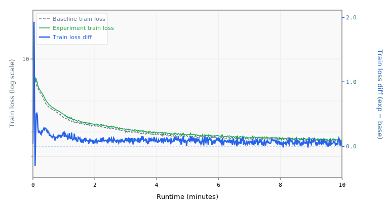

# 011 11 Transformer Layers

Increases model depth from 9 to 11 layers (5 encoder + 6 decoder).

## Change from baseline

- `num_layers`: 9 → 11
- `num_encoder_layers`: 4 → 5 (computed: `11 // 2`)
- `num_decoder_layers`: 5 → 6 (computed: `11 - 5`)
- Adds ~2.6M parameters (from ~17.1M to ~19.7M at mlp_mult=2)
- Step time increases ~25% (~48ms → ~60ms), reducing total steps from ~12,400 to ~10,000

## Source

- `reference/track_10min_16mb/2026-03-19_MLP3x_QAT_Int6_SlidingWindow/` (11L + MLP 3x, 1.1502 BPB)
- Also used in:
  - `reference/track_10min_16mb/2026-03-20_11L_EfficientPartialXSA_FA3_SWA120/` (11L, 1.1307 BPB)
  - `reference/track_10min_16mb/2026-03-20_11L_XSA4_EMA_Int6_MLP3x_WD04_1.1271/` (11L, 1.1271 BPB)
  - `reference/track_10min_16mb/2026-03-21_11L_XSA4_EMA_PartialRoPE_LateQAT_1.1248/` (11L, 1.1248 BPB)
  - `reference/track_10min_16mb/2026-03-22_11L_EMA_GPTQ-lite_warmdown3500_QAT015_1.1233/` (11L, 1.1233 BPB)
- Every record from 2026-03-20 onward uses 11 layers — it became the standard depth

## Expected impact

- Estimated ~-0.002 to -0.005 BPB (always combined with other changes in records, hard to isolate)
- More depth adds representational capacity, especially for the encoder-decoder skip connection architecture
- Risk: with int8 quantization (baseline), 11 layers may not fit under 16 MB — int6 quantization is needed to fund the extra parameters
- At mlp_mult=2 (baseline), the model should still fit under 16 MB with int8 (~17.1M + 2.6M = 19.7M params × 1 byte ≈ 18.8 MB compressed)

## Status

**Runnable.**

## Runtime Overrides

```yaml
training.pre_training.batch_size: 16
training.pre_training.data.TokenizedDataset.path: /home/kingsley/github/parameter-golf/data/datasets/fineweb10B_sp1024/fineweb_train_*.bin
tokenizers.default.SentencePiece.model_path: /home/kingsley/github/parameter-golf/data/tokenizers/fineweb_1024_bpe.model
```

## Results

- **Steps:** 560
- **Tokens:** 73.4M
- **Train loss:** 2.6489
- **Val loss:** 2.6374
- **Val BPB:** 1.5620

## Train Loss Curve



## vs Baseline ([artifacts_1x_gb10_2](../../baseline/artifacts_1x_gb10_2))

- **Val BPB:** 1.5620 vs 1.5347 (+0.0273)

| | train loss | full | int6 | int8 | mxfp4 | nvfp4 |
| :--- | ---: | ---: | ---: | ---: | ---: | ---: |
| **Experiment** | 2.6489 | 1.5620 | 1.5757 | 1.5627 | 1.6457 | 1.6188 |
| **Baseline** | 2.4895 | 1.5347 | 1.5494 | 1.5522 | 1.6563 | 1.6697 |
| **Delta** | +0.1594 | +0.0273 | +0.0262 | +0.0105 | -0.0106 | -0.0509 |

## Quantization

| | int6 | int8 | mxfp4 | nvfp4 |
| :--- | ---: | ---: | ---: | ---: |
| **BPB** | 1.5757 | 1.5627 | 1.6457 | 1.6188 |
| **Size** | 11.6 MB | 16.3 MB | 10.4 MB | 11.2 MB |

## Config Changes vs Baseline

**train.yaml:**

```diff
@@ -63,7 +63,7 @@
     data:
       TokenizedDataset:
         path: /workspace/parameter-golf/data/datasets/fineweb10B_sp1024/fineweb_train_*.bin
-        shuffle: false
+        shuffle: true
         bin_header_bytes: 1024
     features:
       - SystemDiagnostics:
```

**model.yaml:**

```diff
@@ -6,7 +6,6 @@
       TokenEmbedding:
         init_method: normal
         init_std: 0.005
-        dtype: bfloat16
         norm: RMSNorm
     block:
       SequentialBlock:
@@ -93,13 +92,12 @@
     features:
       - TiedLayers:
           heads.clm.head.weight: embedding.tok_emb.weight
-      - CachedRoPE
 models:
   baseline:
     DecoderTransformer:
       context_length: 1024
       vocab_size: 1024
-      num_layers: 9
+      num_layers: 11
       hidden_size: !expr "self.num_attention_heads * self.head_dim"
       num_attention_heads: 8
       num_key_value_heads: 4
```

## Platform

- **GPU:** NVIDIA GB10 (119.7 GB)
- **GPUs:** 1
- **CPU:** aarch64 (20 cores)
- **RAM:** 120 GB
- **Software:** PyTorch 2.10.0+cu130, CUDA 13.0
