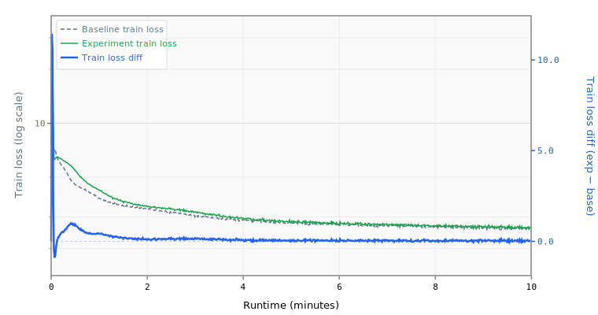

# 015 Doubled Tied Embedding Learning Rate

Doubles the tied embedding learning rate from 0.05 to 0.10.

## Change from baseline

- Adam (embedding) `lr`: 0.05 → 0.10

## Source

- `reference/track_10min_16mb/2026-03-19_SlidingWindow_FP16Emb_10L_MuonWD_OvertoneInit/` (tied_embed_lr=0.10)
- This is the only record to use a value this high; later top records settled on 0.03-0.035

## Expected impact

- Uncertain — later records moved in the opposite direction (lower LR)
- Rationale: with tied embeddings, the weight serves double duty (input embedding + output head), receiving conflicting gradients from both roles; a higher LR may help it find a compromise faster
- Risk: the source record combined this with overtone init, 10 layers, weight decay, and other changes, so the higher LR may only work in that specific context
- Experiment 008-lower-lr found the opposite direction was beneficial at baseline, so this tests the hypothesis that embed LR should diverge from matrix LR

## Status

**Runnable.**

## Runtime Overrides

```yaml
training.pre_training.batch_size: 16
training.pre_training.data.TokenizedDataset.path: /home/kingsley/github/parameter-golf/data/datasets/fineweb10B_sp1024/fineweb_train_*.bin
tokenizers.default.SentencePiece.model_path: /home/kingsley/github/parameter-golf/data/tokenizers/fineweb_1024_bpe.model
```

## Results

- **Steps:** 677
- **Tokens:** 88.7M
- **Train loss:** 2.6144
- **Val loss:** 2.6135
- **Val BPB:** 1.5479

## Train Loss Curve



## vs Baseline ([artifacts_1x_gb10_2](../../baseline/artifacts_1x_gb10_2))

- **Val BPB:** 1.5479 vs 1.5347 (+0.0132)

| | train loss | full | int6 | int8 | mxfp4 | nvfp4 |
| :--- | ---: | ---: | ---: | ---: | ---: | ---: |
| **Experiment** | 2.6144 | 1.5479 | 1.5849 | 1.5501 | 1.7358 | 1.6702 |
| **Baseline** | 2.4895 | 1.5347 | 1.5494 | 1.5522 | 1.6563 | 1.6697 |
| **Delta** | +0.1250 | +0.0132 | +0.0355 | -0.0022 | +0.0795 | +0.0005 |

## Quantization

| | int6 | int8 | mxfp4 | nvfp4 |
| :--- | ---: | ---: | ---: | ---: |
| **BPB** | 1.5849 | 1.5501 | 1.7358 | 1.6702 |
| **Size** | 10.1 MB | 13.8 MB | 8.6 MB | 9.2 MB |

## Config Changes vs Baseline

**train.yaml:**

```diff
@@ -32,7 +32,7 @@
                 patterns: ["embedding.*"]
                 optimizer:
                   Adam:
-                    lr: 0.05
+                    lr: 0.10
                     betas: [0.9, 0.95]
                     eps: 1.0e-8
               - name: block_scalars
@@ -63,7 +63,7 @@
     data:
       TokenizedDataset:
         path: /workspace/parameter-golf/data/datasets/fineweb10B_sp1024/fineweb_train_*.bin
-        shuffle: false
+        shuffle: true
         bin_header_bytes: 1024
     features:
       - SystemDiagnostics:
```

**model.yaml:**

```diff
@@ -6,7 +6,6 @@
       TokenEmbedding:
         init_method: normal
         init_std: 0.005
-        dtype: bfloat16
         norm: RMSNorm
     block:
       SequentialBlock:
@@ -93,7 +92,6 @@
     features:
       - TiedLayers:
           heads.clm.head.weight: embedding.tok_emb.weight
-      - CachedRoPE
 models:
   baseline:
     DecoderTransformer:
```

## Platform

- **GPU:** NVIDIA GB10 (119.7 GB)
- **GPUs:** 1
- **CPU:** aarch64 (20 cores)
- **RAM:** 120 GB
- **Software:** PyTorch 2.10.0+cu130, CUDA 13.0
