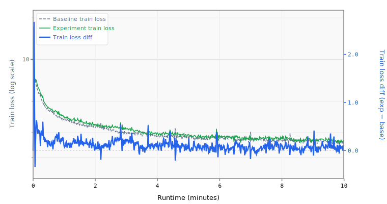

# 031-mlp-mult-4.5

## Runtime Overrides

```yaml
training.pre_training.batch_size: 16
training.pre_training.data.TokenizedDataset.path: /home/kingsley/github/parameter-golf/data/datasets/fineweb10B_sp1024/fineweb_train_*.bin
```

## Results

- **Steps:** 642
- **Tokens:** 84.1M
- **Train loss:** 2.6369
- **Val loss:** 2.6270
- **Val BPB:** 1.5558

## Train Loss Curve



## vs Baseline ([artifacts_1x_gb10_2](../../baseline/artifacts_1x_gb10_2))

- **Val BPB:** 1.5558 vs 1.5347 (+0.0211)

| | train loss | full | int8 | turboquip4c |
| :--- | ---: | ---: | ---: | ---: |
| **Experiment** | 2.6369 | 1.5558 | 1.5568 | 1.6023 |
| **Baseline** | 2.4895 | 1.5347 | 1.5522 | 1.5765 |
| **Delta** | +0.1474 | +0.0211 | +0.0045 | +0.0258 |

## Quantization

| | int8 | turboquip4c |
| :--- | ---: | ---: |
| **BPB** | 1.5568 | 1.6023 |
| **Size** | 21.9 MB | 9.1 MB |

## Config Changes vs Baseline

**train.yaml:**

```diff
@@ -1,5 +1,5 @@
 manifest: !include model.yaml
-model_name: baseline
+model_name: 031-mlp-mult-4.5
 training:
   pre_training:
     gpus: !env WORLD_SIZE:1
```

**model.yaml:**

```diff
@@ -95,7 +95,7 @@
           heads.clm.head.weight: embedding.tok_emb.weight
       - CachedRoPE
 models:
-  baseline:
+  031-mlp-mult-4.5:
     DecoderTransformer:
       context_length: 1024
       vocab_size: 1024
@@ -104,7 +104,7 @@
       num_attention_heads: 8
       num_key_value_heads: 4
       head_dim: 64
-      mlp_mult: 2
+      mlp_mult: 4.5
       intermediate_size: !expr "self.mlp_mult * self.hidden_size"
       num_encoder_layers: !expr "self.num_layers // 2"
       num_decoder_layers: !expr "self.num_layers - self.num_encoder_layers"
```

## Platform

- **GPU:** NVIDIA GB10 (119.7 GB)
- **GPUs:** 1
- **CPU:** aarch64 (20 cores)
- **RAM:** 120 GB
- **Software:** PyTorch 2.10.0+cu130, CUDA 13.0
