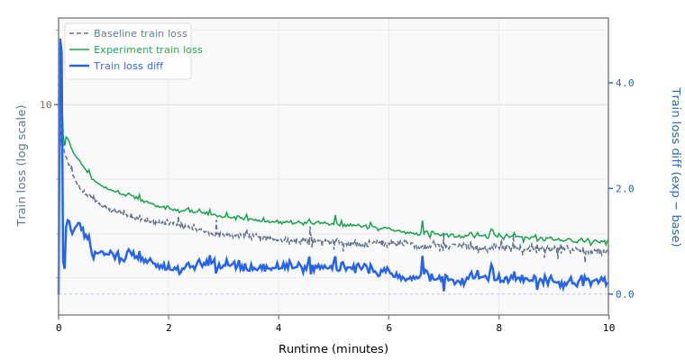

# 032-layers-21

## Runtime Overrides

```yaml
training.pre_training.batch_size: 16
training.pre_training.data.TokenizedDataset.path: /home/kingsley/github/parameter-golf/data/datasets/fineweb10B_sp1024/fineweb_train_*.bin
```

## Results

- **Steps:** 360
- **Tokens:** 47.2M
- **Train loss:** 2.8398
- **Val loss:** 2.8274
- **Val BPB:** 1.6745

## Train Loss Curve



## vs Baseline ([artifacts_1x_gb10_2](../../baseline/artifacts_1x_gb10_2))

- **Val BPB:** 1.6745 vs 1.5347 (+0.1398)

| | train loss | full | int8 | turboquip4c | turboquip4cr |
| :--- | ---: | ---: | ---: | ---: | ---: |
| **Experiment** | 2.8398 | 1.6745 | 1.6750 | 1.8139 | 1.7962 |
| **Baseline** | 2.4895 | 1.5347 | 1.5522 | 1.5765 | 1.5729 |
| **Delta** | +0.3503 | +0.1398 | +0.1228 | +0.2374 | +0.2233 |

## Quantization

| | int8 | turboquip4c | turboquip4cr |
| :--- | ---: | ---: | ---: |
| **BPB** | 1.6750 | 1.8139 | 1.7962 |
| **Size** | 26.8 MB | 8.8 MB | 14.1 MB |

## Config Changes vs Baseline

**train.yaml:**

```diff
@@ -1,5 +1,5 @@
 manifest: !include model.yaml
-model_name: baseline
+model_name: 032-layers-21
 training:
   pre_training:
     gpus: !env WORLD_SIZE:1
```

**model.yaml:**

```diff
@@ -95,11 +95,11 @@
           heads.clm.head.weight: embedding.tok_emb.weight
       - CachedRoPE
 models:
-  baseline:
+  032-layers-21:
     DecoderTransformer:
       context_length: 1024
       vocab_size: 1024
-      num_layers: 9
+      num_layers: 21
       hidden_size: !expr "self.num_attention_heads * self.head_dim"
       num_attention_heads: 8
       num_key_value_heads: 4
```

## Platform

- **GPU:** NVIDIA GB10 (119.7 GB)
- **GPUs:** 1
- **CPU:** aarch64 (20 cores)
- **RAM:** 120 GB
- **Software:** PyTorch 2.10.0+cu130, CUDA 13.0
