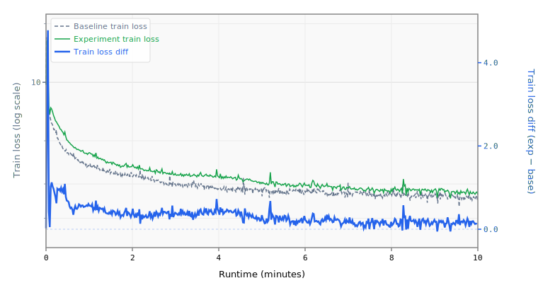

# 033-layers-15-mlp-3

## Runtime Overrides

```yaml
training.pre_training.batch_size: 16
training.pre_training.data.TokenizedDataset.path: /home/kingsley/github/parameter-golf/data/datasets/fineweb10B_sp1024/fineweb_train_*.bin
```

## Results

- **Steps:** 459
- **Tokens:** 60.2M
- **Train loss:** 2.6446
- **Val loss:** 2.7284
- **Val BPB:** 1.6159

## Train Loss Curve



## vs Baseline ([artifacts_1x_gb10_2](../../baseline/artifacts_1x_gb10_2))

- **Val BPB:** 1.6159 vs 1.5347 (+0.0812)

| | train loss | full | int8 | turboquip4c | turboquip4cr |
| :--- | ---: | ---: | ---: | ---: | ---: |
| **Experiment** | 2.6446 | 1.6159 | 1.6167 | 1.6946 | 1.6860 |
| **Baseline** | 2.4895 | 1.5347 | 1.5522 | 1.5765 | 1.5729 |
| **Delta** | +0.1551 | +0.0812 | +0.0645 | +0.1181 | +0.1132 |

## Quantization

| | int8 | turboquip4c | turboquip4cr |
| :--- | ---: | ---: | ---: |
| **BPB** | 1.6167 | 1.6946 | 1.6860 |
| **Size** | 25.4 MB | 9.1 MB | 14.6 MB |

## Config Changes vs Baseline

**train.yaml:**

```diff
@@ -1,5 +1,5 @@
 manifest: !include model.yaml
-model_name: baseline
+model_name: 033-layers-15-mlp-3
 training:
   pre_training:
     gpus: !env WORLD_SIZE:1
```

**model.yaml:**

```diff
@@ -95,16 +95,16 @@
           heads.clm.head.weight: embedding.tok_emb.weight
       - CachedRoPE
 models:
-  baseline:
+  033-layers-15-mlp-3:
     DecoderTransformer:
       context_length: 1024
       vocab_size: 1024
-      num_layers: 9
+      num_layers: 15
       hidden_size: !expr "self.num_attention_heads * self.head_dim"
       num_attention_heads: 8
       num_key_value_heads: 4
       head_dim: 64
-      mlp_mult: 2
+      mlp_mult: 3
       intermediate_size: !expr "self.mlp_mult * self.hidden_size"
       num_encoder_layers: !expr "self.num_layers // 2"
       num_decoder_layers: !expr "self.num_layers - self.num_encoder_layers"
```

## Platform

- **GPU:** NVIDIA GB10 (119.7 GB)
- **GPUs:** 1
- **CPU:** aarch64 (20 cores)
- **RAM:** 120 GB
- **Software:** PyTorch 2.10.0+cu130, CUDA 13.0
