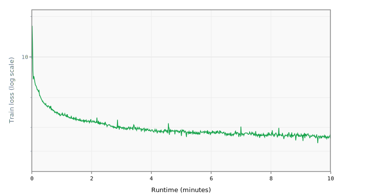

# Baseline

Reproduces OpenAI's [Parameter Golf naive baseline](https://github.com/openai/parameter-golf) using Composer. This is the reference architecture that all experiments are compared against.

## Architecture

GPT-style decoder transformer with encoder-decoder skip connections (U-Net structure).

| Parameter | Value |
|:---|:---|
| Layers | 9 (4 encoder + 5 decoder) |
| Hidden size | 512 |
| Attention heads | 8 (4 KV heads, GQA) |
| Head dim | 64 |
| FFN intermediate | 1024 (mlp_mult=2) |
| Vocab size | 1024 |
| Context length | 1024 |
| Parameters | ~17M |

Key features:
- RMSNorm throughout (no learnable scale)
- RoPE positional embeddings (theta=10000)
- QK normalisation per head
- ReLU² activation in FFN
- Logit soft-capping at 30.0 (Tanh)
- Tied embedding / output head weights, init N(0, 0.005)
- Zero-init output projections
- Encoder-decoder skip connections with learnable residual mixing
- Per-dimension VectorScale on attention and MLP outputs
- Per-head Q gain scaling (init 1.5)

## Training

| Parameter | Value |
|:---|:---|
| Wallclock limit | 600s (10 minutes) |
| Global batch | 524,288 tokens (8 GPUs × 64 seqs × 1024 tokens) |
| Warmup | 10 steps |
| Warmdown | 1200 steps (linear) |
| Precision | bfloat16 (autocast) |
| Compilation | torch.compile (fullgraph, static shapes) |
| Backend | Flash attention |

## Optimizer

Layerwise configuration matching the reference:

| Group | Optimizer | LR | Other |
|:---|:---|:---|:---|
| Matrix params (default) | Muon | 0.04 | momentum 0.85→0.95 over 500 steps, ns_steps=5 |
| Embeddings | Adam | 0.05 | betas=(0.9, 0.95) |
| Block scalars (1D) | Adam | 0.04 | betas=(0.9, 0.95) |

## Data

FineWeb 10B tokenised with SentencePiece BPE (1024 vocab). Validation on the first 50k documents of the FineWeb validation split.

## Reference BPB

The OpenAI reference baseline achieves **1.2244 BPB** on the validation set (8xH100, 10 minutes).

## Runtime Overrides

```yaml
training.pre_training.batch_size: 16
training.pre_training.data.TokenizedDataset.path: /home/kingsley/github/parameter-golf/data/datasets/fineweb10B_sp1024/fineweb_train_*.bin
```

## Results

- **Steps:** 829
- **Tokens:** 108.7M
- **Train loss:** 2.4895
- **Val loss:** 2.5913
- **Val BPB:** 1.5347

## Train Loss Curve



## Quantization

| | int4 | int6 | int8 | mxfp4 | nvfp4 | turboquip4 | turboquip4c |
| :--- | ---: | ---: | ---: | ---: | ---: | ---: | ---: |
| **BPB** | 1.9033 | 1.5494 | 1.5522 | 1.6563 | 1.6697 | 1.9710 | 1.5765 |
| **Size** | 5.5 MB | 9.9 MB | 10.1 MB | 8.5 MB | 8.7 MB | 5.6 MB | 5.8 MB |

## Platform

- **GPU:** NVIDIA GB10 (119.7 GB)
- **GPUs:** 1
- **CPU:** aarch64 (20 cores)
- **RAM:** 120 GB
- **Software:** PyTorch 2.10.0+cu130, CUDA 13.0
