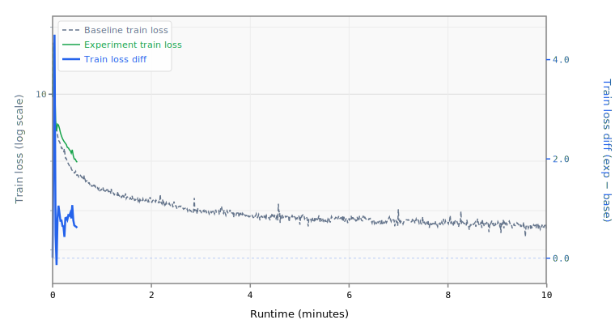

# 1-mlpmult2-layers15

## Sweep Overrides

```yaml
model.num_layers: 15
model.mlp_mult: 2
```

## Results

- **Steps:** 26
- **Tokens:** 3.4M
- **Train loss:** 4.9492
- **Val loss:** 4.8805
- **Val BPB:** 2.8905

## Train Loss Curve



## vs Baseline ([artifacts_1x_gb10_2](../../baseline/artifacts_1x_gb10_2))

- **Val BPB:** 2.8905 vs 1.5347 (+1.3558)

| | train loss | full | int8 |
| :--- | ---: | ---: | ---: |
| **Experiment** | 4.9492 | 2.8905 | 2.8915 |
| **Baseline** | 2.4895 | 1.5347 | 1.5522 |
| **Delta** | +2.4597 | +1.3558 | +1.3392 |

## Quantization

| | int8 |
| :--- | ---: |
| **BPB** | 2.8915 |
| **Size** | 14.9 MB |

## Platform

- **GPU:** NVIDIA GB10 (119.7 GB)
- **GPUs:** 1
- **CPU:** aarch64 (20 cores)
- **RAM:** 120 GB
- **Software:** PyTorch 2.10.0+cu130, CUDA 13.0
