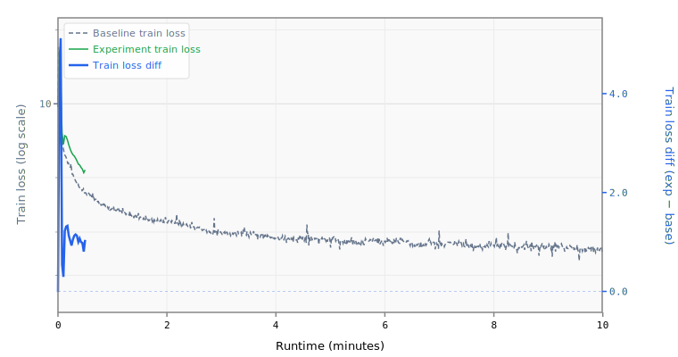

# 3-mlpmult4-layers15

## Sweep Overrides

```yaml
model.num_layers: 15
model.mlp_mult: 4
```

## Results

- **Steps:** 21
- **Tokens:** 2.8M
- **Train loss:** 5.3774
- **Val loss:** 5.0722
- **Val BPB:** 3.0040

## Train Loss Curve



## vs Baseline ([artifacts_1x_gb10_2](../../baseline/artifacts_1x_gb10_2))

- **Val BPB:** 3.0040 vs 1.5347 (+1.4693)

| | train loss | full | int8 |
| :--- | ---: | ---: | ---: |
| **Experiment** | 5.3774 | 3.0040 | 3.0038 |
| **Baseline** | 2.4895 | 1.5347 | 1.5522 |
| **Delta** | +2.8879 | +1.4693 | +1.4516 |

## Quantization

| | int8 |
| :--- | ---: |
| **BPB** | 3.0038 |
| **Size** | 22.0 MB |

## Platform

- **GPU:** NVIDIA GB10 (119.7 GB)
- **GPUs:** 1
- **CPU:** aarch64 (20 cores)
- **RAM:** 120 GB
- **Software:** PyTorch 2.10.0+cu130, CUDA 13.0
