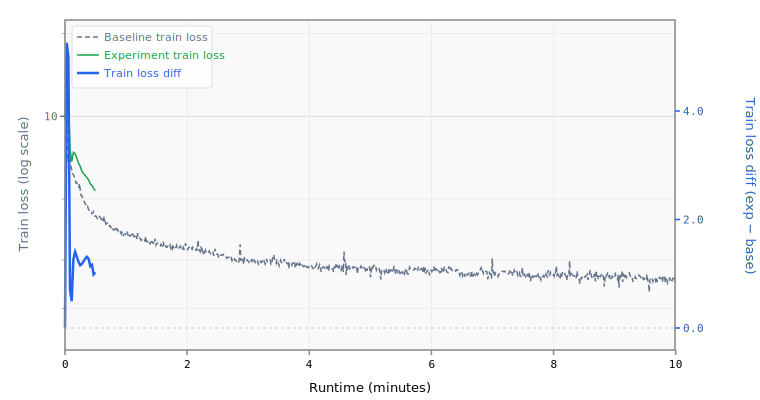

# 4-mlpmult5-layers15

## Sweep Overrides

```yaml
model.num_layers: 15
model.mlp_mult: 5
```

## Results

- **Steps:** 6
- **Tokens:** 0.8M
- **Train loss:** 7.2919
- **Val loss:** 7.2226
- **Val BPB:** 4.2776

## Train Loss Curve



## vs Baseline ([artifacts_1x_gb10_2](../../baseline/artifacts_1x_gb10_2))

- **Val BPB:** 4.2776 vs 1.5347 (+2.7429)

| | train loss | full |
| :--- | ---: | ---: |
| **Experiment** | 7.2919 | 4.2776 |
| **Baseline** | 2.4895 | 1.5347 |
| **Delta** | +4.8024 | +2.7429 |

## Platform

- **GPU:** NVIDIA GB10 (119.7 GB)
- **GPUs:** 1
- **CPU:** aarch64 (20 cores)
- **RAM:** 120 GB
- **Software:** PyTorch 2.10.0+cu130, CUDA 13.0
