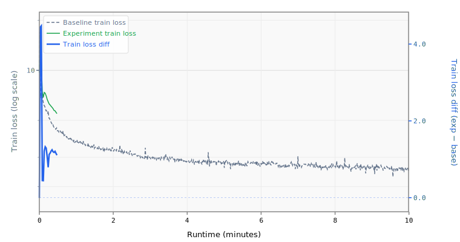

# 5-mlpmult2-layers20

## Sweep Overrides

```yaml
model.num_layers: 20
model.mlp_mult: 2
training.pre_training.batch_size: 32
```

## Results

- **Steps:** 7
- **Tokens:** 0.9M
- **Train loss:** 7.2993
- **Val loss:** 6.9953
- **Val BPB:** 4.1430

## Train Loss Curve



## vs Baseline ([artifacts_1x_gb10_2](../../baseline/artifacts_1x_gb10_2))

- **Val BPB:** 4.1430 vs 1.5347 (+2.6083)

| | train loss | full |
| :--- | ---: | ---: |
| **Experiment** | 7.2993 | 4.1430 |
| **Baseline** | 2.4895 | 1.5347 |
| **Delta** | +4.8099 | +2.6083 |

## Platform

- **GPU:** NVIDIA GB10 (119.7 GB)
- **GPUs:** 1
- **CPU:** aarch64 (20 cores)
- **RAM:** 120 GB
- **Software:** PyTorch 2.10.0+cu130, CUDA 13.0
