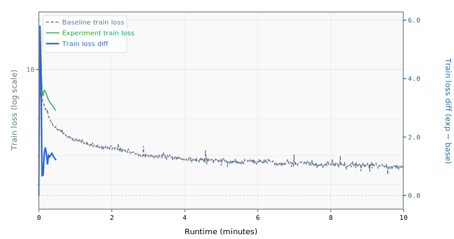

# 6-mlpmult3-layers20

## Sweep Overrides

```yaml
model.num_layers: 20
model.mlp_mult: 3
training.pre_training.batch_size: 32
```

## Runtime Overrides

```yaml
training.pre_training.batch_size: 16
training.pre_training.max_wallclock_seconds: 10
training.pre_training.data.TokenizedDataset.path: /home/kingsley/github/parameter-golf/data/datasets/fineweb10B_sp1024/fineweb_train_*.bin
manifest.tokenizers.default.SentencePiece.model_path: /home/kingsley/github/parameter-golf/data/tokenizers/fineweb_1024_bpe.model
```

## Results

- **Steps:** 6
- **Tokens:** 0.8M
- **Train loss:** 7.4526
- **Val loss:** 7.4802
- **Val BPB:** 4.4302

## Train Loss Curve



## vs Baseline ([artifacts_1x_gb10_2](../../baseline/artifacts_1x_gb10_2))

- **Val BPB:** 4.4302 vs 1.5347 (+2.8955)

| | train loss | full |
| :--- | ---: | ---: |
| **Experiment** | 7.4526 | 4.4302 |
| **Baseline** | 2.4895 | 1.5347 |
| **Delta** | +4.9631 | +2.8955 |

## Platform

- **GPU:** NVIDIA GB10 (119.7 GB)
- **GPUs:** 1
- **CPU:** aarch64 (20 cores)
- **RAM:** 120 GB
- **Software:** PyTorch 2.10.0+cu130, CUDA 13.0
